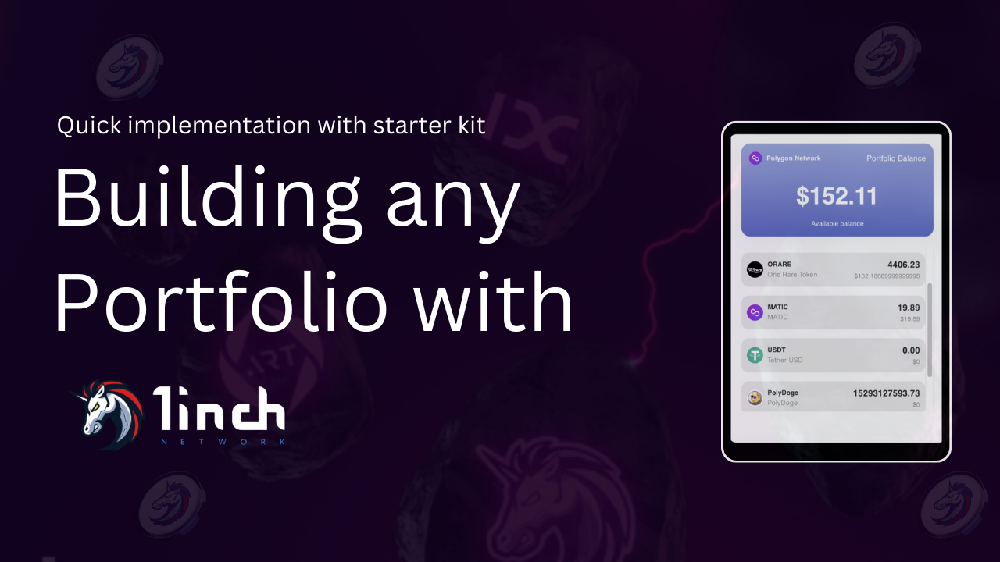

# Web3 Onboarding Starter Kit - ReactJs

This starter kit has been created and crafted to provide an initial grasp and configuration for a various web3 tools for smooth onboarding to web3.

Starter kit code is organised by folder names:

- **Web3Auth-setup - Web3Auth Starter Kit**
  

- **waku-setup - Waku Starter Kit**
  

- **1Inch-setup - 1Inch Starter Kit**
  

**About Me:**
**Tahir Ahmad**, BlockChain Lead at OneRare and having aim to onboard people to Web3.
